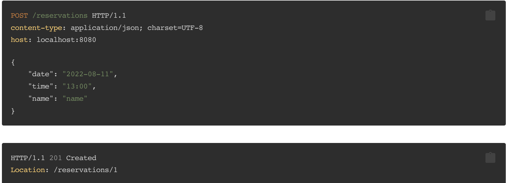

# 방탈출 프로젝트

### 1단계 요구사항

* 웹 요청 / 응답 처리로 입출력 추가
* 예약 하기
  * 예약 조회
  * 예약 취소
* 예외 처리
  * 예약 생성 시 날짜와 시간이 똑같은 예약이 이미 있는 경우 예약을 생성할 수 없다.
---------------------------------------------------------------
### 2단계 요구사항
* 콘솔 애플리케이션에 데이터베이스를 적용한다.
  * 직접 커넥션을 만들어서 데이터베이스에 접근한다.
* 웹 애플리케이션에 데이터베이스를 적용한다.
  * 스프링이 제공하는 기능을 활용하여 데이터베이스에 접근한다.
---------------------------------------------------------------
### 3단계 요구사항
* 테마 관리 기능 추가
  * 모든 테마의 시간표는 동일함
* 요구사항에 없는 내용이 있다면 직접 요구사항을 추가해서 애플리케이션을 완성
  * 실제 애플리케이션이라고 생각했을 때 발생할 수 있는 예외 상황을 고려하고 처리한다.
* 테마를 관리하는 테이블을 추가한다.
* 콘솔 애플리케이션과 웹 애플리케이션의 로직의 중복을 제거한다.
  * 디비 접근을 담당하는 객체를 별도로 만들어 사용한다.
  * 비즈니스 로직을 담당하는 객체를 별도로 만들어 사용한다.

### 예외처리
1. 예약 생성
  - 동일 날짜/시간 동일 테마에 예약 불가능
  - 예약 시간은 11:30~22:00까지 1시간 반 단위로 예약(TimeTable)
  - 없는 테마 아이디에 대해 예약 불가능
2. 예약 조회
  - 아이디에 해당하는 예약이 없을 경우 조회 불가능
3. 예약 취소
  - 아이디에 해당하는 예약이 없을 경우 삭제 불가능
4. 테마 생성
  - 테마 이름이 같은 경우 생성 불가능
5. 테마 목록 조회
  - 테마가 없는 경우 조회 불가능
6. 테마 삭제
  - 아이디에 해당하는 테마가 없을 경우 삭제 불가능

**API 설계 예시**

*<예약>*

* 예약생성

* 예약조회

* 예약삭제

*<테마>*

* 테마생성

* 테마조회

* 테마삭제

