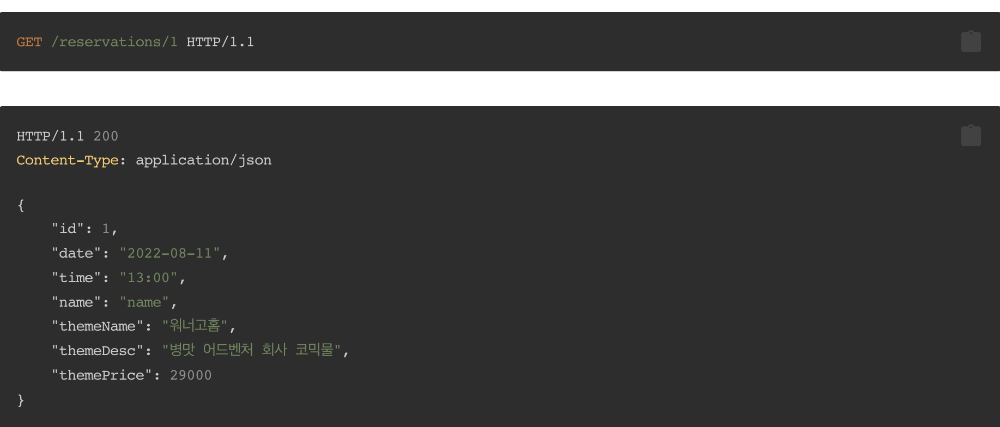

# 방탈출 프로젝트

### 1단계 요구사항

* 웹 요청 / 응답 처리로 입출력 추가
* 예약 하기
  * 예약 조회
  * 예약 취소
* 예외 처리
  * 예약 생성 시 날짜와 시간이 똑같은 예약이 이미 있는 경우 예약을 생성할 수 없다.
---------------------------------------------------------------
### 2단계 요구사항
* 콘솔 애플리케이션에 데이터베이스를 적용한다.
  * 직접 커넥션을 만들어서 데이터베이스에 접근한다.
* 웹 애플리케이션에 데이터베이스를 적용한다.
  * 스프링이 제공하는 기능을 활용하여 데이터베이스에 접근한다.

**API 설계**
* 예약생성

* 예약조회

* 예약삭제

### Tes**tCase**
* 방탈출 예약이 가능함
* 방탈출 예약이 되었다면 조회할 수 있음
* 방탈출 예약이 되었다면 취소할 수 있음
* 동일한 날짜/시간대에 예약을 하는 경우, 예외가 발생